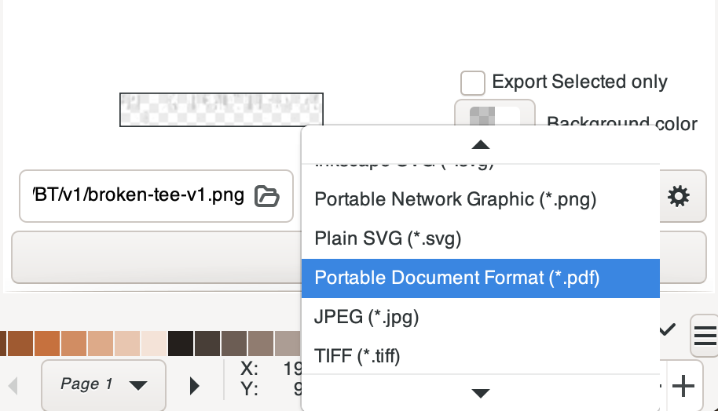
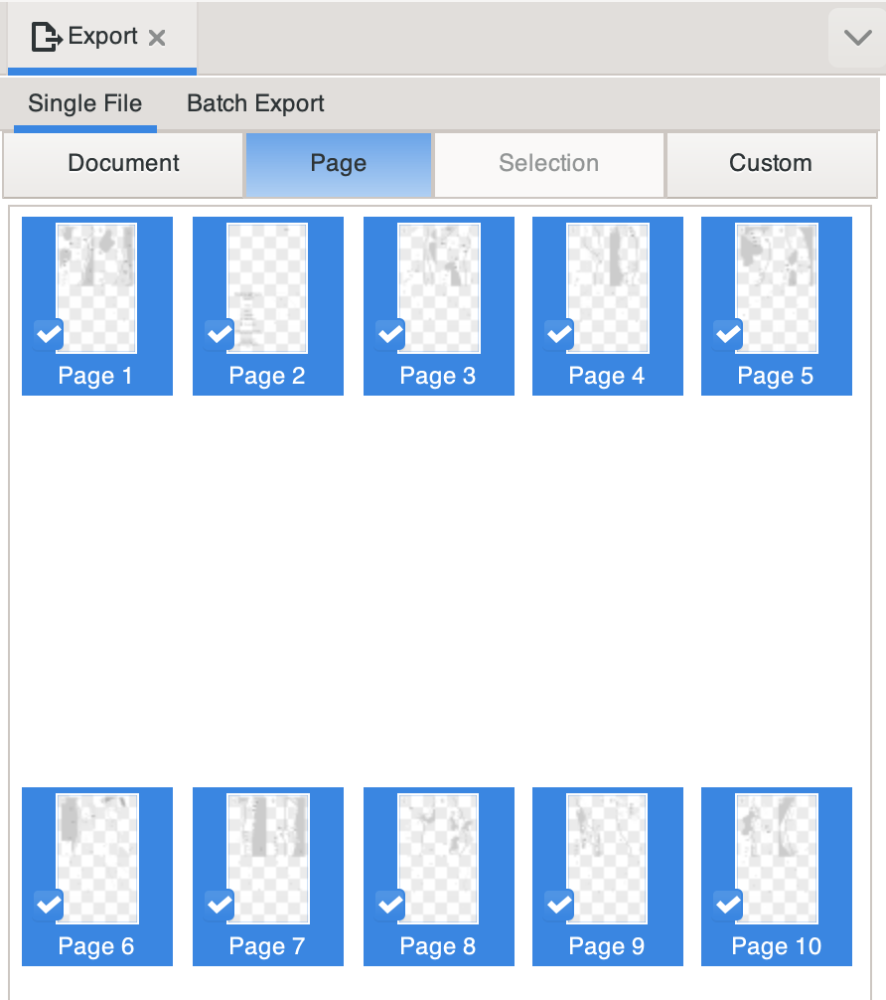
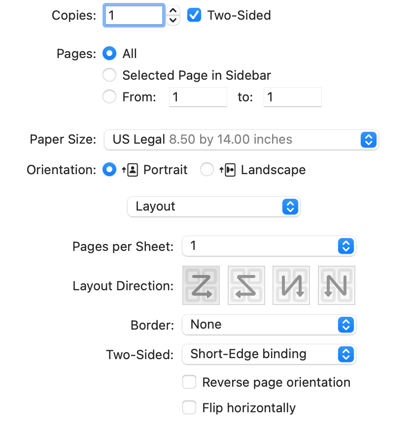
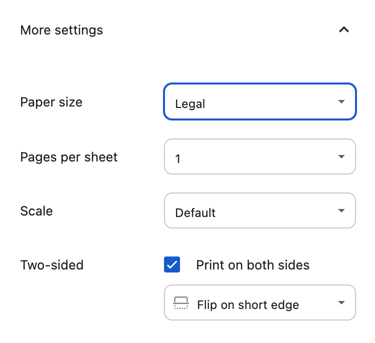

# Broken Tee Yardage Book

## Printing Instructions
1. Clone this repository, or download the [broken-tee-yardage-book.svg](https://github.com/rossedfort/broken-tee-yardage-book/blob/main/broken-tee-yardage-book.svg) file directly.
1. Download and install [Inkscape](https://inkscape.org/release/).
1. Open `broken-tee-yardage-book.svg` in Inkscape.
1. Select `File > Export`.

1. Change the export format to `pdf`.

1. Select the `Page` tab, and ensure all pages are selected.

1. Click `Export`
1. Open the PDF in your PDF viewer of choice.
1. Print the PDF on US Legal (8.5 x 14 in.) Paper. 
    1. If using MacOS Preview.app, ensure you select the "two-sided" option, and that the print is set up for "Short-Edge binding".
  
    1. If using Chrome, ensure you select "Print on both sides" and "Flip on short edge".
  
1. Cut each sheet along its vertical center.
1. Fold each sheet along its horizontal center.
1. Assemble the individual pages into a booklet, and staple in the center using a long-reach stapler.

## Comments or Suggestions
If you have comments or suggestions, feel free to [open an Issue](https://github.com/rossedfort/broken-tee-yardage-book/issues/new), or email [broken-tee-yardage-book@rossedfort.com](mailto:broken-tee-yardage-book@rossedfort.com).

## Contributing

1. Fork this repository.
1. Download and install [Inkscape](https://inkscape.org/release/).
1. Open `broken-tee-yardage-book.svg` in Inkscape, make your changes, and save the file.
1. Create a feature branch, commit your changes with a descriptive commit message, and publish your feature branch in your fork of this repository.
1. Open a Pull Request. The base branch of your Pull Request should be the branch in this repository that corresponds with the current latest version of the yardage book. For example, if the current latest version of the booklet is `v1.x`, create a Pull Request against the `v1` branch, if the current latest version of the booklet is `v2.x`, create a Pull Request against the `v2` branch, etc. You can find the latest version by viewing the [published tags](https://github.com/rossedfort/broken-tee-yardage-book/tags) in GitHub.
